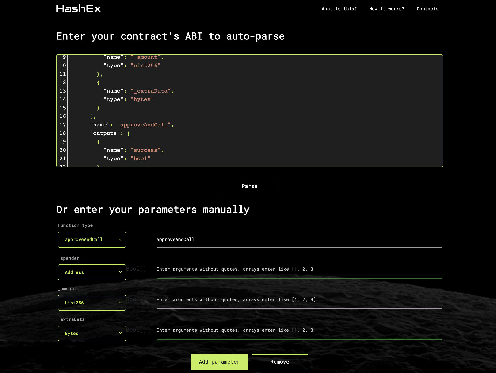
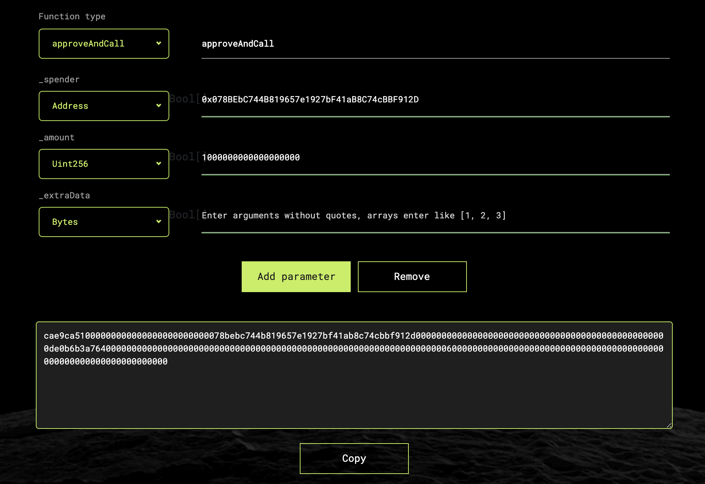
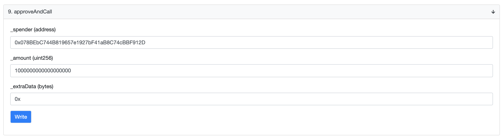

# Upgrading with contract interactions

## TL;DR

From a wallet holding ANTv1, you can upgrade all of its ANTv1 balance into ANTv2 by sending this `approveAndCall()` transaction:

```
to: 0x960b236A07cf122663c4303350609A66A7B288C0 (this is ANTv1's contract address)
data: 0xcae9ca51000000000000000000000000078bebc744b819657e1927bf41ab8c74cbbf912dffffffffffffffffffffffffffffffffffffffffffffffffffffffffffffffff00000000000000000000000000000000000000000000000000000000000000600000000000000000000000000000000000000000000000000000000000000000
```

## The `ANTv2Migrator` contract

The migration contract, deployed to [`0x078BEbC744B819657e1927bF41aB8C74cBBF912D`](https://etherscan.io/address/0x078BEbC744B819657e1927bF41aB8C74cBBF912D), facilitates the official upgrade of ANTv1 to ANTv2.

When a wallet upgrades its ANT balance through an on-chain interaction with this contract, the following happens:

1. `ANTv2Migrator` pulls the requested amount of ANTv1 from the wallet's balance into its own balance
2. `ANTv2Migrator` burns the pulled ANTv1 by transferring it to [`0x000000000000000000000000000000000000dEaD`](https://etherscan.io/address/0x000000000000000000000000000000000000dead)
3. From its own balance, `ANTv2Migrator` sends the equivalent amount of ANTv2 back to the wallet's balance

## Interacting with the `ANTv2Migrator`

### `approveAndCall()`

The simplest approach to completing the migration is by sending a single transaction, calling `ANTv1.approveAndCall()`. `approveAndCall()` allows you to create an allowance to a contract and spend it in the same transaction.

To create such a call, you may pull out your favourite tool and use the following ABI:

```
[{"constant":false,"inputs":[{"name":"_spender","type":"address"},{"name":"_amount","type":"uint256"},{"name":"_extraData","type":"bytes"}],"name":"approveAndCall","outputs":[{"name":"success","type":"bool"}],"payable":false,"type":"function"}]
```

For the purposes of demonstration, I'll use the [online ABI encoder provided by HashEx](https://abi.hashex.org/#):



For the arguments, use:

- `_spender`: `0x078BEbC744B819657e1927bF41aB8C74cBBF912D` (this is the migration contract's address)
- `_amount`: amount of ANTv1 to upgrade, denominated in wei (i.e. multiply by 1e18 for "decimal-correct" amounts)
- `_extraData`: can be left blank (not used)

Next, take the encoded data:



In the above screenshot, I've specified to only upgrade one (1) ANTv1.

You may now take this data and use it in a transaction where the `to` address is `0x960b236A07cf122663c4303350609A66A7B288C0` (this is ANTv1's address).

For example, to use the above data, you would send a transaction with the following data:

```
to: 0x960b236A07cf122663c4303350609A66A7B288C0
data: cae9ca51000000000000000000000000078bebc744b819657e1927bf41ab8c74cbbf912d0000000000000000000000000000000000000000000000000de0b6b3a764000000000000000000000000000000000000000000000000000000000000000000600000000000000000000000000000000000000000000000000000000000000000
```


For contract-based smart accounts and multisig wallets, they will typically have functions specifying the `to` and `data` components of a transaction.

Specify those accordingly based on the above output.


If you'd prefer to use Etherscan, you may submit the above arguments directly to their [ANTv1 contract interface](https://etherscan.io/address/0x960b236a07cf122663c4303350609a66a7b288c0#writeContract):



### Separate token allowances

If you prefer to not use an `approveAndCall()` transaction, you can upgrade in two steps by first creating an allowance (through `ANTv1.approve()`) for at least the amount desired to the migration contract at `0x078BEbC744B819657e1927bF41aB8C74cBBF912D`, and then calling one of:

- `migrate(uint256)`: Allows you to directly specify how much you'd like to upgrade
- `migrateAll()`: Assumes you want to upgrade all of your balance (and that you've set an
  appropriate allowance)

On the migration contract.

### Using an `EscrowANTv2Migrator` contract

In some situations, you may prefer to complete the upgrade without ever creating a token approval and only using vanilla `ANTv1.transfer()` interactions.

To do so, first deploy an [`EscrowANTv2Migrator`](https://github.com/aragon/aragon-network-token/blob/master/packages/v2/contracts/EscrowANTv2Migrator.sol) configured with your desired recipient of the upgraded tokens and the account allowed to initiate the migration.

Once this contract is deployed, simply transfer ANTv1 into the contract as desired and then call
`migrate()` to complete the upgrade.


The `EscrowANTv2Migrator` contract does not contain logic to return any ANTv1 tokens transferred to it. All ANTv1 tokens transferred to it will be eventually converted to ANTv2 and returned to the configured recipient.

