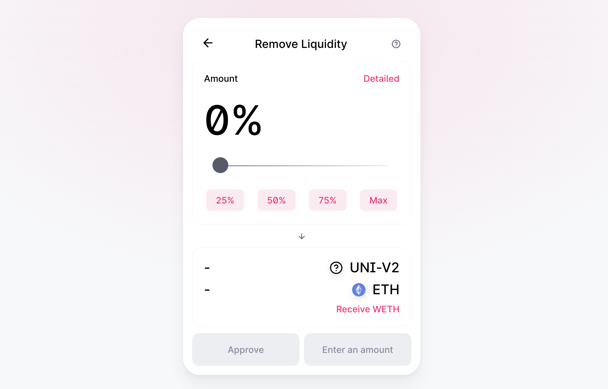
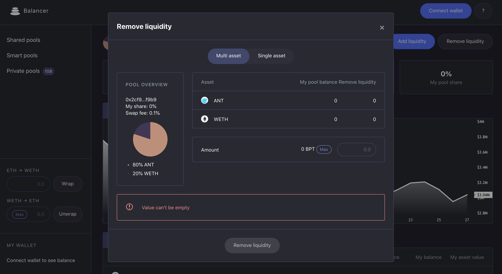

# Migrating on-chain liquidity from ANTv1 to ANTv2

ANTv1's on-chain liquidity has historically been concentrated across two platforms:

- [Uniswap](#uniswap)
- [Balancer](#balancer)

## Uniswap

First, withdraw any ANTv1 liquidity you've provided. For example, from the [ANTv1/ETH UniswapV2 pool](https://app.uniswap.org/#/remove/0xfa19de406e8f5b9100e4dd5cad8a503a6d686efe/ETH):

Then, use [any of the upgrade paths](upgrade.md) to upgrade the ANTv1 in your wallet to ANTv2.

Finally, you can now add liquidity to the equivalent (or new) ANTv2 pools on Uniswap. You can use [ANTv2's Uniswap analytics page](https://info.uniswap.org/token/0xa117000000f279d81a1d3cc75430faa017fa5a2e) to find ANTv2's liquidity pools.

## Balancer

First, withdraw any ANTv1 liquidity you've provided. For example, from the [ANTv1/WETH 80:20 pool](https://pools.balancer.exchange/#/pool/0x2cf9106faf2c5c8713035d40df655fb1b9b0f9b9/):

Then, use [any of the upgrade paths](./upgrade) to upgrade the ANTv1 in your wallet to ANTv2.

Finally, you can now add liquidity to the equivalent (or new) ANTv2 pools on Balancer. You can use [Balancer's ANTv2 pools page](https://pools.balancer.exchange/#/?token=0xa117000000f279d81a1d3cc75430faa017fa5a2e&filter=1) to find ANTv2's liquidity pools.
